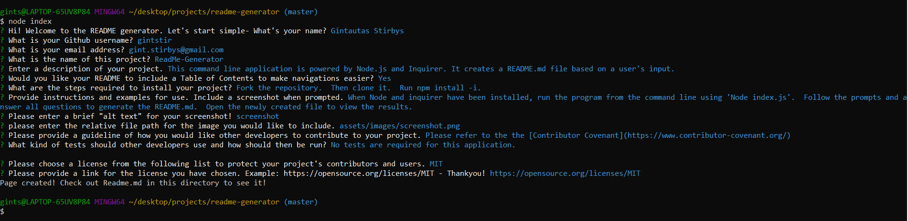

  # **ReadMe-Generator**       

  ## **Description**

  ReadMe-generator does exactly that.  As a Node.js powered command line application it creates a professional, and stylish README.md file based on a user's input. This input is created by a user responding to prompts generated with the Inquirer npm.

  ## **Table of Contents**

  * *[Installation](#installation)*
  * *[Usage](#usage)*
  * *[Contributing](#contributing)*
  * *[Tests](#tests)*
  * *[Questions](#questions)*
  * *[License](#license)*
  
   
  ## **Installation**
  
  To create a README, first- `clone` or `fork/clone` this repository(see contributing section).  Install the required dependencies for this project: `npm install --inquirer`.  The application can be run using the command `node index.js` from the command line.

  ## **Usage**

  After running the command `node index.js` the user will be prompted with a series of questions.   The application then uses the responses to these prompts to generate a README using the fs module `fs.writeFile()`.  Once the file has been created, see the newly create README.md file in your file directory.  Enjoy!
  
  ### *Screenshots*
  
  > 

  ## **Contributing**

  Please refer to the **[Contributor Covenant](https://www.contributor-covenant.org/)** for contribution guidelines.

  ## **Tests**  
  
  No test need to be run at this time. 

  ## **Questions**

  For any questions, comments, or feedback please feel free to reach out:  
  - [Github](https://github.com/gintstir) 
  - <gint.stirbys@gmail.com>

  ## **License** 

  Copyright © Gintautas Stirbys, 2020.  All Rights Reserved.

  This Project is licensed under the **[Apache~2.0](https://www.apache.org/licenses/LICENSE-2.0)** license.

           
