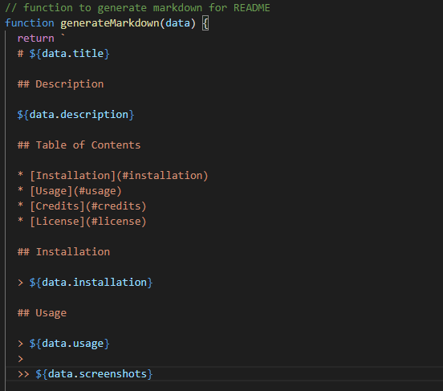

  # Readme Generator       

  ## Description

  An app for making cheese

  ## Table of Contents

  * [Installation](#installation)
  * [Usage](#usage)
  * [Credits](#credits)
  * [License](#license)
  * [Questions](#questions)
   
  ## Installation

  npm install

  ## Usage

  nswer prompts as they are presented.  Open readme in file directory when finished to view new readme.
  
  > ### Screenshots   

  ## License 

  Copyright © Gintautas Stirbys, 2020.  All Rights Reserved.

  This Project is licensed under the **[MIT](https://opensource.org/licenses/MIT)** license.

           
